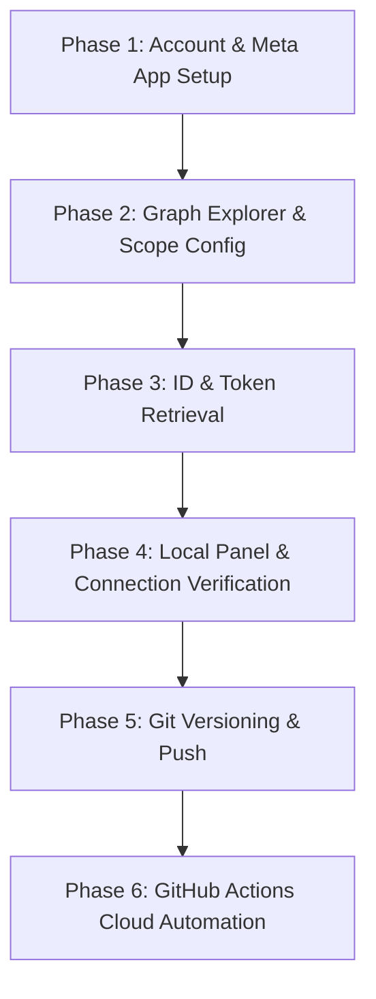

# 🗺️ Instagram Auto-DM Bot Integration & Setup Roadmap

This document provides a detailed, step-by-step roadmap of the configuration, token retrieval, troubleshooting, and deployment steps followed to build the Instagram Auto-DM bot.

---

## 📌 Roadmap Overview


---

## 📂 Phase 1: Account Preparation & App Setup
The foundation requires linking Facebook and Instagram Business assets.

1. **Instagram Professional Account**:
   - Converted the Instagram target account to a **Professional Account (Creator/Business)**.
2. **Linked Facebook Page**:
   - Created a Facebook Page and connected the Instagram account via Page Settings > Linked Accounts.
3. **Meta Developer Application**:
   - Created a new App on the [Meta Developer Portal](https://developers.facebook.com/) choosing the **Business** use case.
   - Associated the Facebook Page and Instagram accounts with the developer profile.

---

## 🔑 Phase 2: Modern Permissions & Scopes
Configured the modern consolidated Instagram Business login scopes in the [Meta Graph API Explorer](https://developers.facebook.com/tools/explorer/).

* **Permissions selected**:
  - `instagram_business_basic`: Grants access to general profile data and media lists.
  - `instagram_business_manage_messages`: Permits reading and sending private replies (DMs) to comment triggers.
  - `instagram_manage_comments`: Allows scanning comment threads and posting public comment replies.

---

## 🎯 Phase 3: Retrieving IDs & Page Tokens (Failsafe Method)
Obtained all system-level IDs and solved the Graph Explorer UI "resetting" issue.

### 1. Extracting Account & Page IDs
Queried the versioned Graph Explorer endpoint `GET /v25.0/me/accounts?fields=instagram_business_account{id,username}` to retrieve linked assets:
* **Facebook Page ID**: `<YOUR_FACEBOOK_PAGE_ID>`
* **Instagram Business Account ID**: `<YOUR_INSTAGRAM_BUSINESS_ACCOUNT_ID>`

### 2. Extracting Page Access Token
To prevent the Graph Explorer UI from resetting back to a *User Token* (which triggers `"An unknown error has occurred"` on DM attempts):
* Queried:
  ```http
  GET /v25.0/me/accounts?fields=access_token,name
  ```
* Copied the specific `"access_token"` string returned inside the JSON payload for the page.

---

## 💻 Phase 4: Local Panel & Connection Verification
Validated configurations locally using the interactive console.

1. **Started local server**:
   ```bash
   python auto_dm.py --dashboard
   ```
2. **Dashboard Configuration**:
   - Opened `http://localhost:8000`.
   - Pasted the Page Access Token, Page ID, and Instagram ID.
   - Saved settings, generating the local gitignored `config.json`.
3. **Tested Connection**:
   - Hit **Test Connection** to confirm Meta API authentication.
4. **Resolved DM Errors**:
   - Addressed initial `"Failed to send DM... An unknown error has occurred"` reports by switching the token to the Page-specific token and ensuring the account was in the developer group.
5. **Verified Rules**:
   - Ran a manual scan and verified that the bot successfully sent DMs and posted public replies to test comments.

---

## 🚀 Phase 5: Git Versioning & Remote Push
Staged and pushed codebase to public version control.

1. **Created Git Repository**:
   - Set up `.gitignore` to prevent leaking `config.json` containing Page access tokens.
   - Run commands:
     ```bash
     git init
     git add .
     git commit -m "initial commit: instagram auto-dm bot with local dashboard"
     ```
2. **Linked & Pushed to GitHub**:
   - Connected remote repository `https://github.com/AlokRepo/InstaDMbot.git`.
   - Pushed main branch:
     ```bash
     git branch -M main
     git push -u origin main
     ```

---

## 🤖 Phase 6: GitHub Actions Cloud Automation
Set up serverless polling to run continuously without a local machine.

### Step 1: Add Repository Secrets
Navigate to **GitHub Repository Settings > Secrets and Variables > Actions > Secrets** and add:
* `INSTAGRAM_ACCESS_TOKEN` (Long-Lived Page Access Token)
* `INSTAGRAM_BUSINESS_ACCOUNT_ID` (Your Instagram Business Account ID)
* `FACEBOOK_PAGE_ID` (Your Facebook Page ID)

### Step 2: Configure Actions Write Permissions
Enable Git writes to allow the action to commit the processed comment cache:
* Go to **Settings > Actions > General**.
* Under **Workflow permissions**, select **Read and write permissions**.
* Click **Save**.

### Step 3: Execution
The poller `.github/workflows/instagram_auto_dm.yml` runs every **15 minutes**, analyzing recent posts/reels and updating the `sent_comments.json` cache on the main branch.
